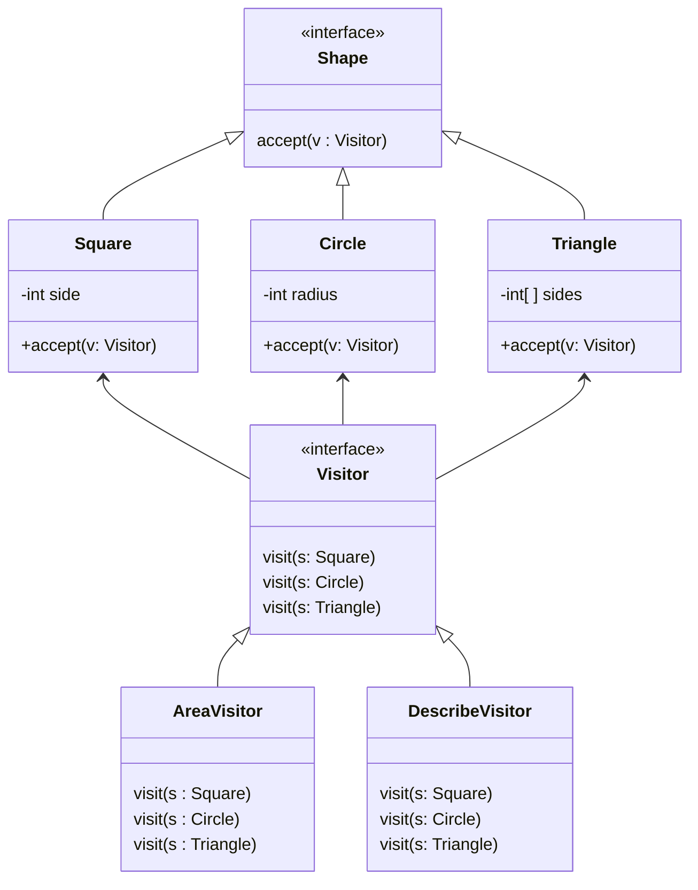

# Coding Challenge UML

## Mermaid Chart

```mermaid
classDiagram 
class Visitor {
    visit(s: Square)
    visit(s: Circle)
    visit(s: Triangle)
}
<<interface>> Visitor
Visitor <|-- AreaVisitor
Visitor <|-- DescribeVisitor

class Shape {
accept(v : Visitor)
}
<<interface>> Shape
Shape <|-- Square
Shape <|-- Circle
Shape <|-- Triangle

class Square{
    -int side
    +accept(v: Visitor)
}
Square <-- Visitor

class Circle{
    -int radius
    +accept(v: Visitor)
}
Circle <-- Visitor

class Triangle {
    -int[ ] sides
    +accept(v: Visitor)
}
Triangle <-- Visitor

class AreaVisitor{
    visit(s : Square)
    visit(s : Circle)
    visit(s : Triangle)
}

class DescribeVisitor{
    visit(s: Square)
    visit(s: Circle)
    visit(s: Triangle)
}
```
